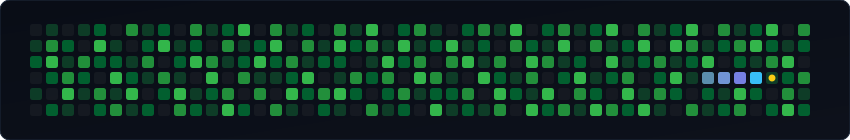

  <!-- Hero Banner -->
  

    

  <!-- Dynamic Typing Subtitle -->
  

   

---

### 🧗 About Me

- 🚀 **Fullstack Developer** focused on building modern, scalable, and production-ready applications.
- 🎓 **Software Engineering Student** with strong foundations across frontend ecosystems, backend microservices, and system architecture.
- 🌐 **Proven hands-on experience** across **Frontend** *(Next.js, React 19, Tailwind CSS)*, **Backend** *(Node.js, Express 5)*, **Databases** *(MySQL, Prisma ORM, Drizzle ORM)*, and **Mobile** *(Flutter & Dart)*.
- 💡 **Passionate about clean code**, modular component architecture, end-to-end type safety, and efficient API design.
- 📈 **Always learning, shipping**, and elevating software engineering practices through real-world digital products.
- 💡 *I enjoy turning complex, multifaceted problems into simple, elegant, high-performing, and maintainable software solutions.*

---

### ⚔️ Tech Arsenal

<h4 align="center">Frontend Development</h4>

  
  
  
  
  
  
  
  
  
  
  
  
  

<h4 align="center">Backend &amp; Database</h4>

  
  
  
  
  
  
  
  
  

<h4 align="center">State Management, Auth &amp; Validation</h4>

  
  
  
  
  
  

<h4 align="center">Realtime Communication &amp; Networking</h4>

  
  
  

<h4 align="center">DevOps, Cloud &amp; Deployment</h4>

  
  
  
  
  
  

<h4 align="center">Development Tools</h4>

  
  
  
  
  
  
  
  

<h4 align="center">Data Structures, Algorithms &amp; Architecture</h4>

  
  
  
  
  

---

### 🤝 Let's Connect

  
  &nbsp;
  
  &nbsp;
  
  &nbsp;
  

---

### 📂 Featured Repositories

<table width="100%">
  <tr>
    <td width="50%" valign="top">
      <h4>🌐 <a href="https://github.com/kaysan2519/CryptoLegalWeb">CryptoLegalWeb</a></h4>
      
Modern crypto legal advisory and regulatory intelligence web application built with Next.js and React 19, delivering fluid interactions and dynamic dashboards.

      

        <code>Next.js</code> &bull; <code>React 19</code> &bull; <code>Tailwind CSS v4</code> &bull; <code>Framer Motion</code> &bull; <code>TypeScript</code>
      

      

        <a href="https://github.com/kaysan2519/CryptoLegalWeb"><b>Explore Repository &rarr;</b></a>
      

    </td>
    <td width="50%" valign="top">
      <h4>🏥 <a href="https://github.com/kaysan2519/WebRumahSakit">MedCare RME (WebRumahSakit)</a></h4>
      
Electronic Medical Record (RME) hospital administration system with interactive clinical telemetry charts, Clerk authentication, and patient records.

      

        <code>React 18</code> &bull; <code>Vite</code> &bull; <code>Clerk Auth</code> &bull; <code>Recharts</code> &bull; <code>Tailwind CSS</code>
      

      

        <a href="https://github.com/kaysan2519/WebRumahSakit"><b>Explore Repository &rarr;</b></a>
      

    </td>
  </tr>
  <tr>
    <td width="50%" valign="top">
      <h4>📚 <a href="https://github.com/kaysan2519/WebPerpus">WebPerpus</a></h4>
      
Full-stack digital library management suite with database schema migrations, automated seeding, role-based Clerk security, and real-time catalog search.

      

        <code>Next.js 14</code> &bull; <code>Prisma ORM</code> &bull; <code>TypeScript</code> &bull; <code>Clerk</code> &bull; <code>MySQL</code>
      

      

        <a href="https://github.com/kaysan2519/WebPerpus"><b>Explore Repository &rarr;</b></a>
      

    </td>
    <td width="50%" valign="top">
      <h4>📱 <a href="https://github.com/kaysan2519/ATS">ATS (Attendance &amp; Tracking System)</a></h4>
      
Comprehensive attendance tracking ecosystem featuring a Flutter mobile client and a high-performance Express.js REST backend powered by Drizzle ORM.

      

        <code>Flutter</code> &bull; <code>Dart</code> &bull; <code>Express.js 5</code> &bull; <code>Drizzle ORM</code> &bull; <code>MySQL</code>
      

      

        <a href="https://github.com/kaysan2519/ATS"><b>Frontend (Flutter) &rarr;</b></a> &bull; <a href="https://github.com/kaysan2519/backend_ats"><b>Backend (API) &rarr;</b></a>
      

    </td>
  </tr>
</table>

---

### 📊 GitHub Activity &amp; Analytics

  <table border="0">
    <tr>
      <td align="center" valign="middle">
        
      </td>
      <td align="center" valign="middle">
        
      </td>
    </tr>
  </table>

   

  

---

### 🐍 Contribution Graph

  <picture>
    <source media="(prefers-color-scheme: dark)" srcset="https://raw.githubusercontent.com/kaysan2519/kaysan2519/output/github-contribution-grid-snake-dark.svg" />
    <source media="(prefers-color-scheme: light)" srcset="https://raw.githubusercontent.com/kaysan2519/kaysan2519/output/github-contribution-grid-snake.svg" />
    
  </picture>

 

  ⚡ Designed with high precision, modern engineering &amp; aesthetic passion &bull; Muhammad Kaysan &copy; 2026

